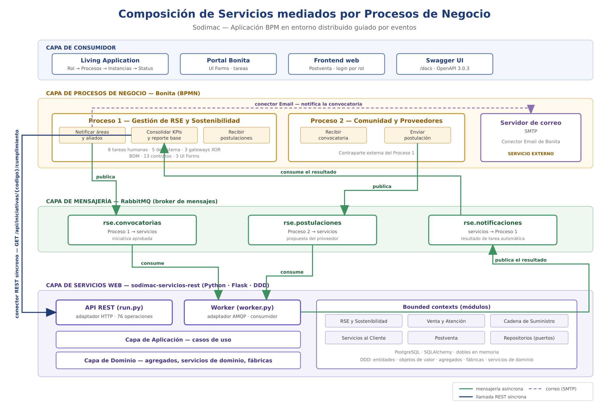
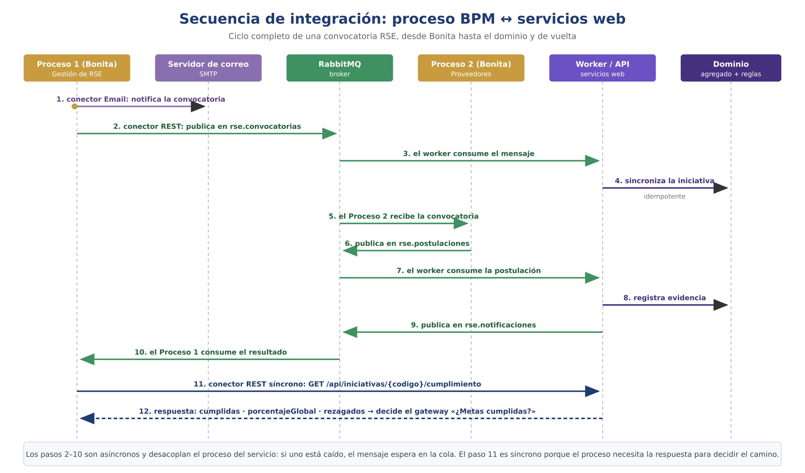
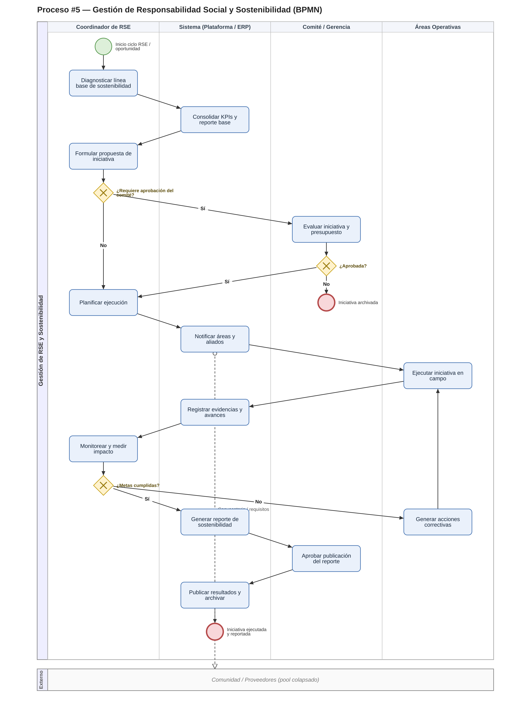
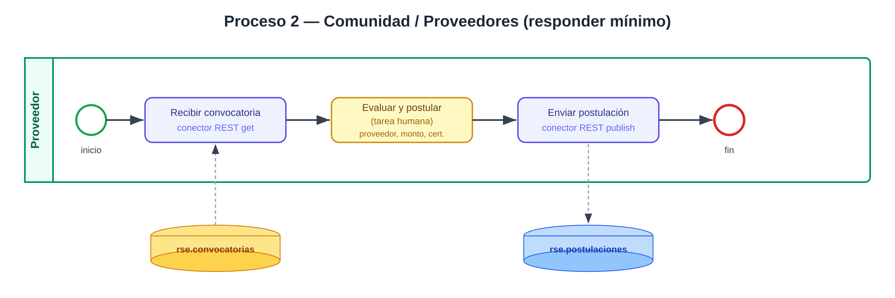
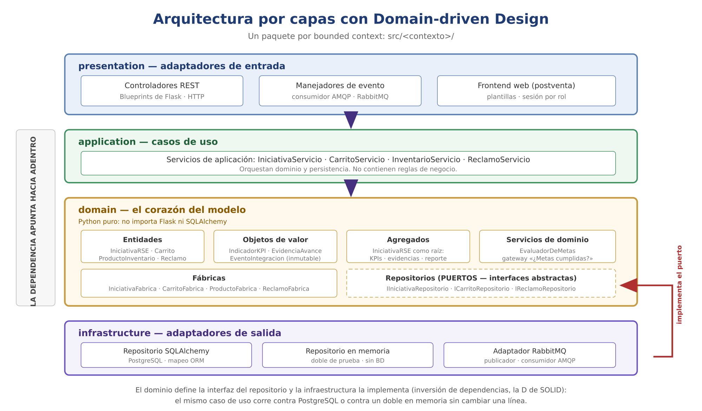

# Sodimac — Aplicación BPM en un entorno distribuido guiado por eventos

**Proyecto Final · Desarrollo de Software Empresarial · UNSA 2026-B**
Docente: Edgar Sarmiento Calisaya

Procesos de negocio modelados y ejecutados en **Bonita (BPMN)** que **orquestan servicios web
autónomos**, integrados mediante conectores de correo, conectores REST y un **broker de
mensajes (RabbitMQ)**.

| | |
| --- | --- |
| 🏢 **Cliente** | Sodimac — retail de mejoramiento del hogar *(organización ficticia)* |
| 📦 **Repositorio BPMN** | este repositorio |
| 🔌 **Repositorio de servicios** | [`sodimac-servicios-rest`](https://github.com/Cristhianepcc/sodimac-servicios-rest) |
| 📋 **Tablero Kanban** | [GitHub Project](https://github.com/users/Cristhianepcc/projects/4) |

---

## Equipo

| # | Apellidos y Nombres | Responsabilidad |
| --- | --- | --- |
| 1 | *(por completar)* | Venta y Atención al Cliente |
| 2 | *(por completar)* | Reabastecimiento — órdenes de compra y almacén |
| 3 | *(por completar)* | Reabastecimiento — proveedores |
| 4 | *(por completar)* | Reabastecimiento — recepción, distribución y auditoría |
| 5 | *(por completar)* | Servicios al Cliente — instalaciones |
| 6 | Pérez Chipa, Erick Jesús | Postventa y frontend web |
| 7 | Taipe, Cristhian | RSE, integración por eventos y servicios web |

---

## 1. El problema y la decisión de diseño

Los procesos de negocio de Sodimac existen y están documentados, pero la lógica que los
sostiene está dispersa y duplicada entre sistemas: cuando cambia una regla, hay que tocarla en
varios sitios.

**La decisión central del proyecto es separar el flujo de las reglas:**

| | Dónde vive | Por qué |
| --- | --- | --- |
| **El flujo** — quién hace qué, en qué orden, bajo qué condiciones | Bonita, en BPMN | Visible y modificable por el negocio |
| **Las reglas y los datos** | Servicios web autónomos | Reutilizables desde cualquier proceso |

> El motor BPM **orquesta** servicios; no los sustituye. Así un mismo servicio se compone desde
> varios procesos sin duplicarse, que es el objetivo central de SOA.

---

## 2. Visión general: Aplicación BPM

Aplicación web (*Living Application*) para **rastrear y crear instancias** de procesos según el
perfil del usuario.

**Menú: Rol → Procesos → Instancias → Status**

| Menú | Contenido | Perfiles con acceso |
| --- | --- | --- |
| Inicio | Bienvenida y accesos directos | Todos |
| Mis procesos | Procesos que el usuario puede iniciar | Todos |
| Mis tareas | Tareas pendientes asignadas | Todos |
| Instancias y estado | Casos abiertos con su estado actual | Coordinador RSE |
| Iniciativas RSE | Listado consultado al servicio REST | Coordinador RSE, Comité |

### Roles de la organización

| Actor Bonita | Rol de negocio | Usuario |
| --- | --- | --- |
| `actorCoordinadorRSE` | Coordinador de RSE / Sostenibilidad | `coordinador.rse` |
| `actorComite` | Comité de Sostenibilidad / Gerencia | `comite.sost` |
| `actorAreasOperativas` | Áreas Operativas (Tiendas / CD / Logística) | `Operario` |
| `actorProveedor` | Proveedor / Comunidad | `proveedor` |

---

## 3. Composición de servicios mediados por procesos



La arquitectura tiene **cuatro capas**: consumidor, procesos de negocio, mensajería y servicios
web. Los procesos se integran con los servicios por **tres vías complementarias**:

| Vía | Tarea del proceso | Destino |
| --- | --- | --- |
| 📧 **Conector Email (SMTP)** | Notificar áreas y aliados | Servidor de correo *(servicio externo)* |
| 🔄 **Conector REST síncrono** | Consolidar KPIs y reporte base | `GET /api/iniciativas/{codigo}/cumplimiento` |
| 📨 **Mensajería asíncrona** | Notificar · Consolidar · Recibir postulaciones | Colas de RabbitMQ |

### Las tres colas

| Cola | Sentido | Contenido |
| --- | --- | --- |
| `rse.convocatorias` | Proceso 1 → servicios | Iniciativa aprobada |
| `rse.postulaciones` | Proceso 2 → servicios | Postulación del proveedor |
| `rse.notificaciones` | Servicios → Proceso 1 | Resultado de la tarea automática |

> **Por qué dos mecanismos y no uno.** Lo asíncrono **desacopla en el tiempo**: si el servicio
> está caído, el mensaje espera en la cola y el proceso no se pierde. Lo síncrono se reserva
> para cuando el proceso necesita la respuesta *en ese momento* para decidir el camino.

### Secuencia completa



Decisiones que sostienen la integración:

- **Puerto y adaptadores** — la aplicación publica eventos sin conocer AMQP; hay un doble en
  memoria para probar sin broker.
- **Idempotencia** — RabbitMQ entrega *al menos una vez*; reprocesar un mensaje no duplica datos.
- **Ack manual y `prefetch=1`** — el mensaje se confirma solo cuando el caso de uso terminó
  bien; si el worker cae a medio camino, el trabajo no se pierde.
- **Colas durables y mensajes persistentes** — ninguna de las dos partes pierde trabajo si la
  otra está caída.

---

## 4. Procesos de negocio

### 4.1 Proceso 1 — Gestión de RSE y Sostenibilidad

Ciclo completo de una iniciativa de sostenibilidad: diagnóstico de línea base, formulación,
evaluación por el comité, ejecución en campo, monitoreo de KPIs y publicación del reporte.



| Elemento | Detalle |
| --- | --- |
| **Estructura** | 2 pools · 5 lanes · 8 tareas humanas · 5 tareas de sistema · 3 gateways XOR |
| **Modelo de datos (BDM)** | `IniciativaRSE`, `IndicadorKPI`, `EvidenciaAvance`, `ReporteSostenibilidad`, `AccionCorrectiva` |
| **Contratos** | 13 definidos sobre las tareas humanas |
| **UI Forms** | `formInicioRSE`, `formEvaluarIniciativa`, `formMonitorearImpacto` |
| **Artefacto** | [`gestion-rse-sostenibilidad/`](gestion-rse-sostenibilidad/) |

**Decisiones del flujo:**

- *¿Requiere aprobación del comité?* — deriva al comité o continúa directamente.
- *¿Aprobada?* — si no lo está, la iniciativa se archiva.
- *¿Metas cumplidas?* — **se resuelve llamando al servicio web**, no con un script embebido.
  La regla vive en el dominio, no en el diagrama.

### 4.2 Proceso 2 — Comunidad y Proveedores

Contraparte externa: recibe la convocatoria, el proveedor evalúa y postula, y la respuesta
vuelve al Proceso 1 por el broker.



Diseño detallado en [`comunidad-proveedores/`](comunidad-proveedores/).

---

## 5. Servicios web consumidos

Documentación en **formato estándar OpenAPI 3.0.3**, explorable con **Swagger UI**.

| | |
| --- | --- |
| **Repositorio** | <https://github.com/Cristhianepcc/sodimac-servicios-rest> |
| **Especificación** | `GET /openapi.json` |
| **Swagger UI** | `GET /docs` — 76 operaciones agrupadas por proceso de negocio |

> La especificación **se deriva del código**, no de un documento paralelo, y hay pruebas
> automáticas que fallan si alguien añade un endpoint sin documentar. Con 5 bounded contexts y
> 7 integrantes, un YAML mantenido a mano se desincroniza al primer merge.

### Recurso `iniciativas` — RSE y Sostenibilidad

*Propósito: gestionar el ciclo completo de una iniciativa de sostenibilidad, desde su
formulación hasta la publicación del reporte.*

| Método | URL | Parámetros |
| --- | --- | --- |
| `POST` | `/api/iniciativas` | `nombre`, `tipo`, `requierePresupuesto`, `presupuestoSolicitado` |
| `GET` | `/api/iniciativas` | — |
| `GET` | `/api/iniciativas/{codigo}` | ruta: `codigo` |
| `POST` | `/api/iniciativas/{codigo}/evaluacion` | `aprobada`, `presupuestoAprobado`, `comentario` |
| `POST` | `/api/iniciativas/{codigo}/indicadores` | `nombre`, `unidad`, `valorLineaBase`, `valorActual`, `meta` |
| `POST` | `/api/iniciativas/{codigo}/evidencias` | `descripcion`, `porcentajeAvance` |
| `POST` | `/api/iniciativas/{codigo}/reporte` | `resumen` |
| `GET` | `/api/iniciativas/{codigo}/cumplimiento` | query: `tolerancia` — **lo consume el conector REST** |

**Modelos:** agregado `IniciativaRSE` (raíz) · objetos de valor `IndicadorKPI`,
`EvidenciaAvance`, `AccionCorrectiva`, `ReporteSostenibilidad` · servicio de dominio
`EvaluadorDeMetas`.

### Recurso `reclamos` — Postventa y Experiencia

*Propósito: gestionar el ciclo de vida de un reclamo, desde que el cliente lo registra hasta
que se resuelve, con separación de responsabilidades por rol.*

Este bounded context expone **cinco recursos** y un frontend web propio con control de acceso:

| Recurso | Operaciones | Quién lo usa |
| --- | --- | --- |
| `/api/reclamos` | `POST` · `GET` · `GET /{id}` · `PUT /{id}` · `POST /{id}/notificacion` | Cliente y Postventa |
| `/api/validaciones` | `POST /verificar` | Postventa |
| `/api/evaluaciones` | `GET` · `POST` | Técnico |
| `/api/soluciones` | `GET` · `POST` | Técnico |
| `/api/notificaciones` | `POST` | Sistema |

**Máquina de estados del reclamo** — las transiciones válidas las conoce el agregado, no la
interfaz:

```
REGISTRADO ──validación──► EN_EVALUACION ──evaluación + solución──► RESUELTO
                                          └──────────────────────► RECHAZADO
```

**Roles del frontend web** (`src/web`), cada ruta protegida por decorador:

| Rol | Puede |
| --- | --- |
| `CLIENTE` | Registrar reclamos y consultar los suyos |
| `POSTVENTA` | Ver todos los reclamos, validarlos y notificar |
| `TECNICO` | Registrar evaluaciones y aplicar soluciones |

> El frontend **no contiene lógica de negocio**: consume los mismos servicios REST que
> consumiría cualquier otro cliente, incluidos los conectores de Bonita.

**Modelos:** agregado `Reclamo` (raíz) · `ReclamoFabrica` · puerto `IReclamoRepositorio`.

### Otros recursos

| Recurso | Propósito | Bounded context |
| --- | --- | --- |
| `ventas/carrito` | Cotización y carrito omnicanal | Venta y Atención al Cliente |
| `inventario` | Control de existencias y reabastecimiento | Cadena de Suministro |
| `ordenes-compra` | Emisión y autorización de órdenes | Cadena de Suministro |
| `proveedores` | Evaluación y homologación | Cadena de Suministro |
| `solicitudes` | Solicitudes de instalación | Servicios al Cliente |

---

## 6. Arquitectura de los servicios: DDD



Arquitectura **por capas** con **Domain-driven Design**. Cada proceso de negocio es un
*bounded context* independiente con su propio modelo.

### Los bloques tácticos

| Bloque | Dónde está |
| --- | --- |
| **Entidad** | `IniciativaRSE`, `Carrito`, `ProductoInventario`, `Reclamo` |
| **Objeto de valor** | `IndicadorKPI`, `EvidenciaAvance`, `ItemCarrito`, `EventoIntegracion` *(inmutable)* |
| **Agregado** | `IniciativaRSE` como raíz: encapsula KPIs, evidencias, reporte y acciones |
| **Servicio de dominio** | `EvaluadorDeMetas` — la regla del gateway «¿Metas cumplidas?» |
| **Fábrica** | `IniciativaFabrica`, `CarritoFabrica`, `ProductoFabrica`, `ReclamoFabrica` |
| **Repositorio** | Puertos `I*Repositorio` + adaptadores en memoria y SQLAlchemy |
| **Módulo** | Un paquete por *bounded context* |

**Dos propiedades que sostienen el diseño:**

1. **La dependencia apunta hacia adentro.** El dominio define la interfaz del repositorio y la
   infraestructura la implementa (inversión de dependencias). Por eso el mismo caso de uso corre
   contra PostgreSQL o contra un doble en memoria sin cambiar una línea.

2. **Las invariantes viven en el agregado**, no en el controlador. «Una iniciativa aprobada
   requiere presupuesto mayor que cero» está en `IniciativaRSE.evaluar()`, así que se cumple
   igual si la petición llega por HTTP o por un evento de RabbitMQ.

### Guiada por eventos

La API HTTP y el consumidor de mensajes son **dos adaptadores de entrada distintos sobre la
misma capa de aplicación**, desplegables y escalables por separado.

---

## 7. Gestión del proyecto

### Ramas

| Rama | Rol |
| --- | --- |
| `master` | Estable |
| `desarrollo` | Integración |
| `feature/*` | Una por funcionalidad |

Ciclo: rama desde `desarrollo` → commits → Pull Request → merge a `desarrollo` → merge a
`master`.

### Tablero Kanban

[**GitHub Project**](https://github.com/users/Cristhianepcc/projects/4) — cada tarjeta lleva
lista de verificación.

| Etiqueta | Contenido |
| --- | --- |
| `requisito` | Historias de usuario o tareas técnicas |
| `mejora` | Refactorizaciones y *code smells* |
| `correccion` | Bugs, vulnerabilidades o defectos |
| `entregable` | Requisitos explícitos del enunciado |
| `exposicion` | Preparación de la sustentación |

### Calidad de código

El repositorio de servicios se analiza con **SonarQube Community** en cada integración. La
medición es continua, no puntual: cada merge se vuelve a analizar y los hallazgos nuevos entran
al tablero como tarjetas de corrección.

| Métrica | Núcleo *(antes de integrar postventa)* | **Estado actual** |
| --- | --- | --- |
| Líneas analizadas | 2 010 | 2 628 |
| Bugs | 0 | 0 |
| Vulnerabilidades | 0 | 1 |
| Code smells | 0 | 6 |
| Duplicación | 0.0 % | 0.0 % |
| Deuda técnica | 0 min | 47 min |
| Fiabilidad · Seguridad · Mantenibilidad | A · A · A | A · D · A |

**Trayectoria.** El primer análisis del núcleo dio **6 Critical, 2 Major y 2 Minor**; se
corrigieron todos hasta dejarlo en cero: literales duplicados extraídos a constantes, una
función con complejidad cognitiva 16 descompuesta en cuatro, y un parámetro que viajaba del
controlador al dominio y se descartaba en silencio —el comentario del comité al evaluar una
iniciativa— que pasó a persistirse.

**Hallazgos abiertos.** La integración del módulo de postventa y su frontend web añadió 618
líneas y con ellas 5 Critical y 1 Major, todos registrados en el tablero:

| Severidad | Hallazgo | Dónde |
| --- | --- | --- |
| Critical | Protección CSRF ausente en los formularios web | `src/__init__.py` |
| Critical | Complejidad cognitiva 17 (máx. 15) | `postventa/application/reclamo_servicio.py` |
| Critical | `datetime.utcnow()` obsoleto desde Python 3.12 (×2) | `postventa/application/reclamo_servicio.py` |
| Critical | Literal duplicado 5 veces | `web/presentation/web_controller.py` |
| Major | Método con 16 parámetros (máx. 13) | `postventa/application/reclamo_servicio.py` |

> El hallazgo de CSRF **no era aplicable** mientras el proyecto era solo una API REST sin
> cookies de sesión: sus clientes eran los conectores de Bonita y el worker, no un navegador.
> Dejó de ser un falso positivo al incorporarse el frontend web con `session["usuario"]` y
> formularios `POST`. La protección debe aplicarse **solo** al blueprint web, dejando fuera la
> API para no romper a los conectores.

Metodología reproducible y detalle de las correcciones en
[`docs/CALIDAD.md`](https://github.com/Cristhianepcc/sodimac-servicios-rest/blob/main/docs/CALIDAD.md).

---

## 8. Puesta en marcha

```bash
# 1) Infraestructura: broker de mensajes + servidor de correo
docker compose up -d
#    RabbitMQ  →  http://localhost:15672   (guest / guest)
#    MailHog   →  http://localhost:8025

# 2) Servicios web — en el repositorio sodimac-servicios-rest
./scripts/demo_up.sh
#    Levanta y VERIFICA las cinco piezas: broker, correo, PostgreSQL, API y worker.
#    Termina publicando una convocatoria igual que el conector de Bonita
#    y comprobando que la API la sirve.  Salida esperada: 5/5 en verde.

./scripts/seed_demo.sh    # datos de demostración
./scripts/demo_down.sh    # apagar todo

# 3) Bonita Studio: importar el .bos, desplegar organización y BDM, y ejecutar
```

> **`REPO_BACKEND=sqlalchemy` es obligatorio en la API y en el worker.** Son procesos
> distintos: con el repositorio en memoria cada uno tiene el suyo y la API responde 404 a lo
> que el worker acaba de sincronizar. El script ya lo configura; el worker se niega a arrancar
> mal configurado en vez de fallar en silencio.

**Requisitos:** Docker · Java JDK 17 · Bonita Studio Community 2023.2

### Usuarios de prueba

Organización `RSE_Sodimac`, contraseña `bpm12345` para todos.

---

## 9. Estructura del repositorio

| Ruta | Contenido |
| --- | --- |
| [`gestion-rse-sostenibilidad/`](gestion-rse-sostenibilidad/) | Proceso 1: `.bos` ejecutable + configuración de conectores |
| [`comunidad-proveedores/`](comunidad-proveedores/) | Proceso 2: diseño del responder |
| `docker-compose.yml` · `rabbitmq/` | RabbitMQ + MailHog y auto-declaración de las 3 colas |
| [`scripts/`](scripts/) | Reproducen con `curl` lo que hacen los conectores |
| [`docs/GUIA_BONITA_TIF.md`](docs/GUIA_BONITA_TIF.md) | Guía paso a paso de la configuración en Studio |
| [`assets/img/`](assets/img/) | Diagramas de arquitectura, composición y secuencia |
| [`NOTES.md`](NOTES.md) | Registro de resultados |

---

## 10. Dónde está cada cosa

Mapa rápido para localizar cada elemento del proyecto:

| Elemento | Dónde |
| --- | --- |
| Aplicación BPM y menú por rol | §2 |
| Diagrama de composición de servicios | §3 |
| Procesos BPMN, BDM, contratos y UI Forms | §4 |
| Conectores: correo, REST y broker | §3 |
| Servicios REST en OpenAPI / Swagger | §5 |
| Arquitectura DDD y bloques tácticos | §6 |
| Ramas, tablero y calidad de código | §7 |
| Cómo ejecutarlo | §8 |
