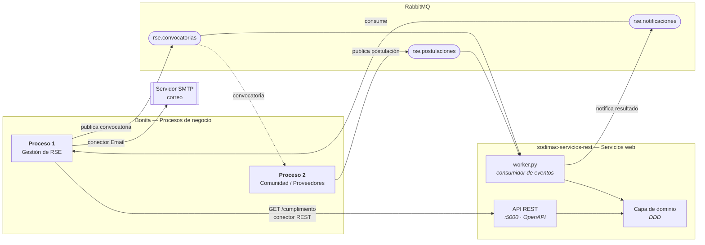

# Sodimac — Aplicación BPM (Proyecto BPMN en Bonita)

Procesos de negocio modelados y ejecutados en **Bonita** (BPMN), integrados con servicios
web propios mediante **conectores REST** y un **broker de mensajes (RabbitMQ)**.

Es el **repositorio del proyecto BPMN** del Proyecto Final del curso *Desarrollo de
Software Empresarial* (UNSA). Su contraparte es el repositorio de servicios web:
[`Cristhianepcc/sodimac-servicios-rest`](https://github.com/Cristhianepcc/sodimac-servicios-rest).

---

## 1. Equipo de trabajo

| | |
| --- | --- |
| **Equipo** | *(por completar)* |
| **Cliente** | Sodimac (organización ficticia — retail de mejoramiento del hogar) |
| **Curso** | Desarrollo de Software Empresarial — UNSA, 2026-B |
| **Docente** | Edgar Sarmiento Calisaya |

**Integrantes**

| # | Apellidos y Nombres | Responsabilidad |
| --- | --- | --- |
| 1 | *(por completar)* | |
| 2 | *(por completar)* | |
| 3 | *(por completar)* | |
| 4 | *(por completar)* | |
| 5 | *(por completar)* | |
| 6 | *(por completar)* | |
| 7 | Taipe, Cristhian | Proceso RSE, integración por eventos y servicios web |

---

## 2. Propósito del proyecto

Automatizar los procesos de negocio de Sodimac en un **entorno distribuido guiado por
eventos**, separando dos responsabilidades que suelen mezclarse:

- **el flujo** — quién hace qué, en qué orden y bajo qué condiciones — vive en Bonita,
  modelado en BPMN y visible para el negocio;
- **las reglas y los datos** viven en **servicios web autónomos**, reutilizables desde
  cualquier proceso.

El motor BPM **orquesta** servicios en lugar de albergar la lógica. Así un mismo servicio
se compone desde varios procesos sin duplicarse, y procesos y servicios se despliegan por
separado.

---

## 3. Visión general: Aplicación BPM

Aplicación web (*Living Application*) que permite **rastrear y crear instancias** de
procesos según el perfil del usuario.

**Menú: Rol → Procesos → Instancias → Status**

| Menú | Contenido | Perfiles con acceso |
| --- | --- | --- |
| Inicio | Bienvenida y accesos directos | todos |
| Mis procesos | Procesos que el usuario puede iniciar | todos |
| Mis tareas | Tareas pendientes asignadas | todos |
| Instancias y estado | Casos abiertos con su estado actual | Coordinador RSE |
| Iniciativas RSE | Listado consultado al servicio REST | Coordinador RSE, Comité |

### Roles (organización `RSE_Sodimac`)

| Actor Bonita | Rol de negocio | Usuario de prueba |
| --- | --- | --- |
| `actorCoordinadorRSE` | Coordinador de RSE / Sostenibilidad | `coordinador.rse` |
| `actorComite` | Comité de Sostenibilidad / Gerencia | `comite.sost` |
| `actorAreasOperativas` | Áreas Operativas (Tiendas / CD / Logística) | `operario` |
| `actorProveedor` | Proveedor / Comunidad | `proveedor` |

Contraseña de todos los usuarios de prueba: `bpm12345`.

> ⚠️ **Estado:** la Living Application está especificada pero **aún no construida** en el
> `.bos`. Pasos en [`docs/GUIA_BONITA_TIF.md`](docs/GUIA_BONITA_TIF.md), bloque D.

---

## 4. Procesos de negocio

### Proceso 1 — Gestión de RSE y Sostenibilidad

Ciclo completo de una iniciativa de sostenibilidad: diagnóstico de línea base, formulación,
evaluación por el comité, ejecución en campo, monitoreo de KPIs y publicación del reporte.

**Elementos:** 2 pools · 5 lanes · 8 tareas humanas · 5 tareas de sistema · 3 gateways XOR.

| Elemento | Detalle |
| --- | --- |
| Modelo de datos (BDM) | `IniciativaRSE`, `IndicadorKPI`, `EvidenciaAvance`, `ReporteSostenibilidad`, `AccionCorrectiva` |
| Contratos | 13 definidos sobre las tareas humanas |
| UI Forms | `formInicioRSE`, `formEvaluarIniciativa`, `formMonitorearImpacto` |
| Artefacto | [`gestion-rse-sostenibilidad/Proceso_RSE_Sodimac.bos`](gestion-rse-sostenibilidad/) |

Decisiones del flujo:

- **¿Requiere aprobación del comité?** — deriva al comité o continúa directo.
- **¿Aprobada?** — si no, la iniciativa se archiva.
- **¿Metas cumplidas?** — resuelto **llamando al servicio web**, no con un script embebido
  (ver §5).

### Proceso 2 — Comunidad y Proveedores

Contraparte externa: recibe la convocatoria, el proveedor evalúa y postula, y la respuesta
vuelve al Proceso 1. Diseño en [`comunidad-proveedores/`](comunidad-proveedores/).

---

## 5. Integración: composición de servicios mediada por procesos



### Servicios y conectores por tarea

| Tarea del proceso | Tipo de integración | Destino |
| --- | --- | --- |
| *Notificar áreas y aliados* | Conector **Email (SMTP)** | Servidor de correo |
| *Notificar áreas y aliados* | Conector **REST** → publica | Cola `rse.convocatorias` |
| *Consolidar KPIs y reporte base* | Conector **REST** → consulta | `GET /api/iniciativas/{codigo}/cumplimiento` |
| *Consolidar KPIs y reporte base* | Conector **REST** → consume | Cola `rse.notificaciones` |
| *Recibir postulaciones* | Conector **REST** → consume | Cola `rse.postulaciones` |

### Colas

| Cola | Sentido | Contenido |
| --- | --- | --- |
| `rse.convocatorias` | Proceso 1 → servicios / Proceso 2 | Iniciativa aprobada (código, nombre, tipo, presupuesto, requisitos) |
| `rse.postulaciones` | Proceso 2 → servicios / Proceso 1 | Postulación del proveedor (propuesta, monto, certificación) |
| `rse.notificaciones` | Servicios → Proceso 1 | Resultado de la tarea automática |

> El servicio web es **idempotente**: RabbitMQ entrega *al menos una vez*, así que
> reprocesar un mensaje no duplica datos.

---

## 6. Principales servicios web consumidos

Documentación completa en **formato estándar OpenAPI 3.0.3** con **Swagger UI**:

| | |
| --- | --- |
| Repositorio | <https://github.com/Cristhianepcc/sodimac-servicios-rest> |
| Especificación | `GET /openapi.json` |
| Swagger UI | `GET /docs` |

### Recurso `iniciativas` — *gestionar el ciclo de una iniciativa de sostenibilidad*

| Método | URL | Parámetros |
| --- | --- | --- |
| `POST` | `/api/iniciativas` | `nombre`, `tipo`, `requierePresupuesto`, `presupuestoSolicitado` |
| `GET` | `/api/iniciativas/{codigo}` | ruta: `codigo` |
| `POST` | `/api/iniciativas/{codigo}/evaluacion` | `aprobada`, `presupuestoAprobado` |
| `POST` | `/api/iniciativas/{codigo}/indicadores` | `nombre`, `unidad`, `valorLineaBase`, `valorActual`, `meta` |
| `POST` | `/api/iniciativas/{codigo}/evidencias` | `descripcion`, `porcentajeAvance` |
| `POST` | `/api/iniciativas/{codigo}/reporte` | `resumen` |
| `GET` | `/api/iniciativas/{codigo}/cumplimiento` | query: `tolerancia` — **usado por el conector REST** |

**Modelos:** agregado `IniciativaRSE` (raíz) · objetos de valor `IndicadorKPI`,
`EvidenciaAvance`, `AccionCorrectiva`, `ReporteSostenibilidad` · servicio de dominio
`EvaluadorDeMetas`.

El resto de recursos (`ventas`, `inventario`, `proveedores`, `reclamos`, `solicitudes`…)
está documentado en `/docs` del servicio.

---

## 7. Puesta en marcha

```bash
# 1) Infraestructura: broker + servidor de correo
docker compose up -d
#    RabbitMQ  -> http://localhost:15672   (guest / guest)
#    MailHog   -> http://localhost:8025

# 2) Servicios web (en el repo sodimac-servicios-rest)
docker compose up -d                                    # PostgreSQL
REPO_BACKEND=sqlalchemy python run.py                   # API  :5000
REPO_BACKEND=sqlalchemy EVENTOS_BACKEND=rabbitmq python worker.py

# 3) Validar la comunicación sin Bonita
./scripts/00_demo_e2e.sh

# 4) Bonita Studio: importar los .bos, desplegar BDM + organización y ejecutar
#    siguiendo docs/GUIA_BONITA_TIF.md
```

> **`REPO_BACKEND=sqlalchemy` es obligatorio en la API y en el worker.** Son procesos
> distintos; con el backend en memoria cada uno tiene su propio repositorio y la API
> responde 404 a lo que el worker acaba de sincronizar. Detalle en la guía.

**Requisitos:** Docker · Java JDK 17 · Bonita Studio Community 2023.2.

---

## 8. Estructura del repositorio

| Ruta | Contenido |
| --- | --- |
| `gestion-rse-sostenibilidad/` | Proceso 1: `.bos` ejecutable + configuración de conectores |
| `comunidad-proveedores/` | Proceso 2: diseño del responder |
| `docker-compose.yml` · `rabbitmq/` | RabbitMQ + MailHog y auto-declaración de las 3 colas |
| `scripts/` | Reproducen con `curl` lo que hacen los conectores (validación sin Bonita) |
| `docs/GUIA_BONITA_TIF.md` | **Guía paso a paso** de lo que falta construir en Studio |
| `assets/img/` | Diagramas de arquitectura, BPMN y secuencia |
| `NOTES.md` | Registro de resultados y mapeo con el enunciado del Lab 6 |

---

## 9. Gestión del proyecto

Tablero Kanban con requisitos, tareas y checklists:
**<https://github.com/users/Cristhianepcc/projects/4>**

| Etiqueta | Contenido |
| --- | --- |
| `requisito` | Historias de usuario o tareas técnicas |
| `mejora` | Refactorizaciones y *code smells* |
| `correccion` | Bugs, vulnerabilidades o defectos |

### Ramas

| Rama | Rol |
| --- | --- |
| `master` | Estable |
| `desarrollo` | Integración |
| `feature/*` | Una por *feature* |
